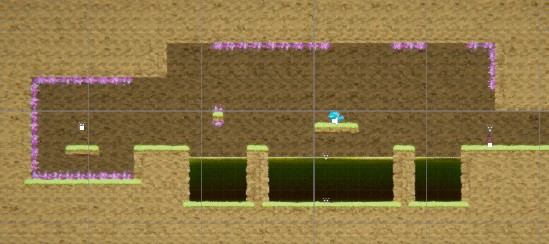
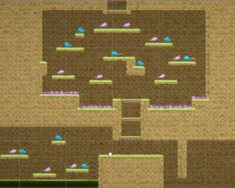
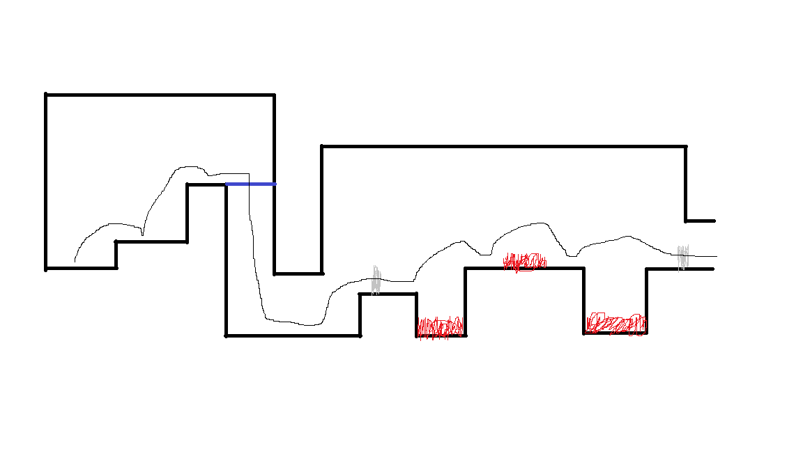
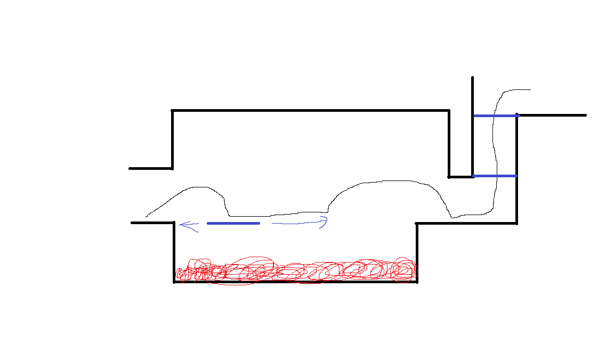
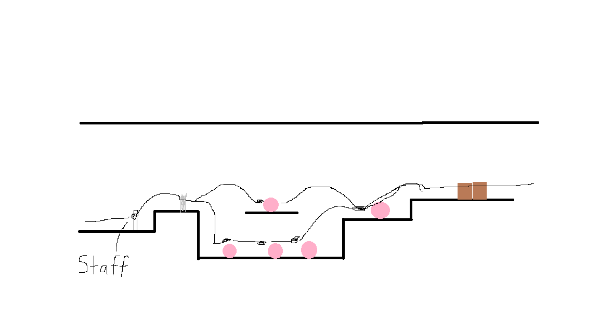
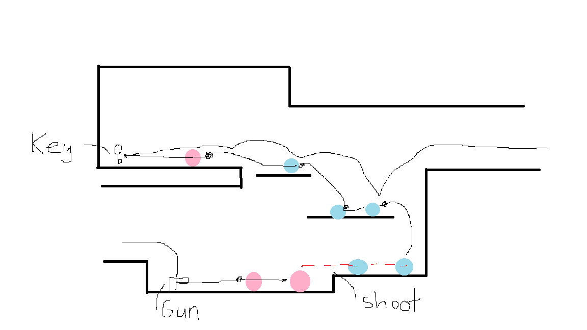

# COMP2150  - Level Design Document
### Name: Anthony Schiro
### Student number: 47300809

## 1. Player Experience (~700 words)

### 1.1. Discovery
The player learns all the fundamental mechanics during the first four encounters of the game which then are used to a higher level of skill in sections 2 and 3. In section 1 these fundamental mechanics are introduced in a safe relatively safe environment where they can experiment with the mechanics and have to choose to fight enemies such as in encounter 3. By the end of section 1, they should have been forced to engage with all the mechanics of the game except for potentially checkpoints and health packages if they did not take damage or fall into acid. In section 2 and 3, the player is tested on these basic mechanics for example in the 2nd key room where they have to not hold down/need to hold down the jump button depending on the jump for smaller or bigger jumps. The spikes have been placed so that if this is not done correctly the player gets hit by the spikes.   

### 1.2. Drama
The level becomes more intense as the game goes on. Section 1 is relatively relaxing with not many enemies and easy parkour, letting the player get adjusted to the controls and the mechanics of the game with a noticable transition at the end to the next section hinting to the player things will get harder. Section 2 becomes a lot more challenging and intense than section 1 especially in the 2nd key room as shown above. In the 2nd key room players are forced into a space with not many safe places with an enemy, acid and spikes filling the room. The players also have to make it back from retrieving the key, traversing the platforms they were just on. After that room the intensity comes down with limited spikes and no acid making the player feel a lot safer and in control. Going into section 3, the transition makes the player jump down a sppike covered hole with the player having no knowledge of what is below them signalling the new section harder more intense section. After jumping down the hole the player is allowed a short respite where they can chill and focus more on exploration instead of acid/enemies.

### 1.3. Challenge
The main challenges of the level are in the rooms where the keys are situated. In Section 1, the key room is the hardest room of Section 1 but still easy enough to get the player accustomed to the game. In Section 2 the challenge of the key room is changed to be more focused on parkour and forcing the player to learn how to jump higher and shorter. The challenge is higher than the 1st key room. The rest of section 2 is also a step up from section 1, having the player face lots of enemies and a optional parkour room if the player wants to try. Section 3 is again more challenging with less health packages making the player have to be more careful with their health. Using both the staff and the gun and planning ahead is needed to make it safely through this section. The key room in section 3 is the hardest encounter in the game with lots of enemies and platforms the player can jump on, spikes covering the floor. This room is still very doable by most players if they take their time and don't rush it. These 3 sections ramp in sifficulty but overall, the level is not too difficult for players that have experienced platforming games before.

### 1.4. Exploration
The game has 2 encounters (key rooms) and 1 optional encounter where the player is encouraged to explore using level design. 

This is the 3rd key room where players are encouraged to explore above them before they drop down to the next encounter and there is no way of coming back. This could potentially be bad for players that don't have much experience with games and get softlocked because they didn't explore before dropping down into an unkown area. Adding in another path to get to the key room or an elevator so that this doesnt happen would improve the level design. Players with experience should insinctively explore above them first leading them to discover the monster den and the key at the top of the encounter similarly to the 2nd key room where the players can look into the room and explore to find the required key at the end of the room.

## 2. Core Gameplay (~400 words)
A section on Core Gameplay, where storyboards are used to outline how you introduce the player to each of the required gameplay elements in the first section of the game. Storyboards should follow the format provided in lectures.

Storyboards can be combined when multiple mechanics are introduced within a single encounter. Each section should include a sentence or two to briefly justify why you chose to introduce the mechanic/s to the player in that sequence.

You should restructure the headings below to match the order they appear in your level.

Three mechanics are introduced in the first encounter of the game, with very easy jumps to get past the spikes and so the player can easily learn about the passthrough polatforms, checkpoints and spikes without having to worry about monsters.

### 2.7. Passthrough Platforms
### 2.8. Spikes
### 2.2. Checkpoints

In the second encounter of the game, moving platforms and acid are introduced with a checkpoint right before so the player doesn't have to repeat the first encounter if they die. It is still very easy with only one moderatetely difficult jump.

### 2.6. Moving Platforms
### 2.1. Acid

Encounter 3 introduces the staff weapon and allows the player to jump into a pit with monsters to learn how it works. The player can easily jump out of the pit if they want so there are low stakes.

### 2.11. Weapon Pickup (Staff)
### 2.3. Chompers

In the fourth encounter, the last 4 mechanics are introduced with health pickups at the start of the ecounter incase the player lost health in the previous encounters. Being very similar to the last encounter makes this encounter easier and should be able to find the key easily.

### 2.4. Health Pickups
### 2.5. Keys
### 2.9. Spitters
### 2.10. Weapon Pickup (Gun)

## 3. Spatiotemporal Design
A section on Spatiotemporal Design, which includes your molecule diagram and annotated level maps (one for each main section of your level). These diagrams may be made digitally or by hand, but must not be created from screenshots of your game. The annotated level maps should show the structure you intend to build, included game elements, and the path the player is expected to take through the level. Examples of these diagrams are included in the level design lectures.

No additional words are necessary for this section (any words should only be within your images/diagrams).
 
### 3.1. Molecule Diagram

### 3.2. Level Map – Section 1

### 3.3.	Level Map – Section 2

### 3.4.	Level Map – Section 3

## 4. Iterative Design (~400 words)
Reflect on how iterative design helped to improve your level. Additional prototypes and design artefacts should be included to demonstrate that you followed an iterative design process (e.g. pictures of paper prototypes, early grey-boxed maps, additional storyboards of later gameplay sequences, etc.). You can also use this section to justify design changes made in Unity after you drew your level design maps shown in section 3. 

You should conclude by highlighting a specific example of an encounter, or another aspect of your level design, that could be improved through further iterative design.

## Generative AI Use Acknowledgement

Use the below table to indicate any Generative AI or writing assistance tools used in creating your document. Please be honest and thorough in your reporting, as this will allow us to give you the marks you have earnt. Place any drafts or other evidence inside this repository. This form and related evidence do not count to your word count.
An example has been included. Please replace this with any actual tools, and add more as necessary.

### Tool Used: ChatGPT
**Nature of Use** Finding relevant design theory.

**Evidence Attached?** Screenshot of ChatGPT conversation included in the folder "GenAI" in this repo.

**Additional Notes:** I used ChatGPT to try and find some more relevant design theory that I could apply to my game. After googling them, however, I found most of them were inaccurate, and some didn't exist. One theory mentioned, however, was useful, and I've incorporated it into my work.

### Tool Used: Example
**Nature of Use** Example Text

**Evidence Attached?** Example Text

**Additional Notes:** Example Text

