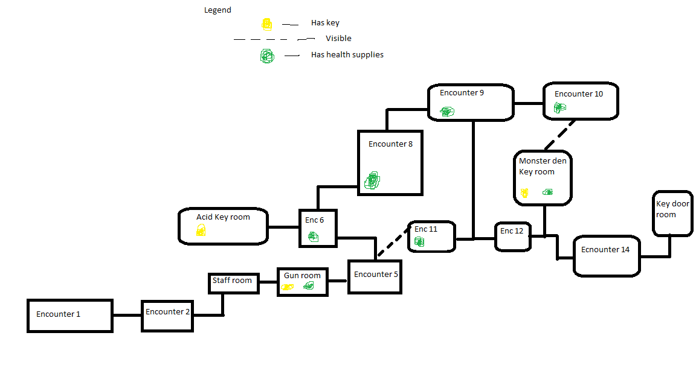

# COMP2150  - Level Design Document
### Name: Anthony Schiro
### Student number: 47300809

## 1. Player Experience (~700 words)

### 1.1. Discovery
The player learns all the fundamental mechanics during the first four encounters of the game which then are used to a higher level of skill in sections 2 and 3. In section 1 these fundamental mechanics are introduced in a safe relatively safe environment where they can experiment with the mechanics and have to choose to fight enemies such as in encounter 3. By the end of section 1, they should have been forced to engage with all the mechanics of the game except for potentially checkpoints and health packages if they did not take damage or fall into acid. In section 2 and 3, the player is tested on these basic mechanics for example in the 2nd key room where they have to not hold down/need to hold down the jump button depending on the jump for smaller or bigger jumps. The spikes have been placed so that if this is not done correctly the player gets hit by the spikes.   

### 1.2. Drama
The level becomes more intense as the game goes on. Section 1 is relatively relaxing with not many enemies and easy parkour, letting the player get adjusted to the controls and the mechanics of the game with a noticable transition at the end to the next section hinting to the player things will get harder. Section 2 becomes a lot more challenging and intense than section 1 especially in the 2nd key room as shown above. In the 2nd key room players are forced into a space with not many safe places with an enemy, acid and spikes filling the room. The players also have to make it back from retrieving the key, traversing the platforms they were just on. After that room the intensity comes down with limited spikes and no acid making the player feel a lot safer and in control. Going into section 3, the transition makes the player jump down a sppike covered hole with the player having no knowledge of what is below them signalling the new section harder more intense section. After jumping down the hole the player is allowed a short respite where they can chill and focus more on exploration instead of acid/enemies.

### 1.3. Challenge
The main challenges of the level are in the rooms where the keys are situated. In Section 1, the key room is the hardest room of Section 1 but still easy enough to get the player accustomed to the game. In Section 2 the challenge of the key room is changed to be more focused on parkour and forcing the player to learn how to jump higher and shorter. The challenge is higher than the 1st key room. The rest of section 2 is also a step up from section 1, having the player face lots of enemies and a optional parkour room if the player wants to try. Section 3 is again more challenging with less health packages making the player have to be more careful with their health. Using both the staff and the gun and planning ahead is needed to make it safely through this section. The key room in section 3 is the hardest encounter in the game with lots of enemies and platforms the player can jump on, spikes covering the floor. This room is still very doable by most players if they take their time and don't rush it. These 3 sections ramp in sifficulty but overall, the level is not too difficult for players that have experienced platforming games before.

### 1.4. Exploration
The game has 2 encounters (key rooms) and 1 optional encounter where the player is encouraged to explore using level design. 

This is the 3rd key room where players are encouraged to explore above them before they drop down to the next encounter and there is no way of coming back. This could potentially be bad for players that don't have much experience with games and get softlocked because they didn't explore before dropping down into an unkown area. Adding in another path to get to the key room or an elevator so that this doesnt happen would improve the level design. Players with experience should insinctively explore above them first leading them to discover the monster den and the key at the top of the encounter similarly to the 2nd key room where the players can look into the room and explore to find the required key at the end of the room.

## 2. Core Gameplay (~400 words)

Legend - 

### 2.7. Passthrough Platforms
### 2.8. Spikes
### 2.2. Checkpoints

Three mechanics are introduced in the first encounter of the game, with very easy jumps to get past the spikes and so the player can easily learn about the passthrough platforms, checkpoints and spikes without having to worry about monsters.

### 2.6. Moving Platforms
### 2.1. Acid

In the second encounter of the game, moving platforms and acid are introduced with a checkpoint right before so the player doesn't have to repeat the first encounter if they die. It is still very easy with only one moderatetely difficult jump.

### 2.11. Weapon Pickup (Staff)
### 2.3. Chompers

Encounter 3 introduces the staff weapon and allows the player to jump into a pit with monsters to learn how it works. The player can easily jump out of the pit if they want so there are low stakes.

### 2.4. Health Pickups
### 2.5. Keys
### 2.9. Spitters
### 2.10. Weapon Pickup (Gun)

In the fourth encounter, the last 4 mechanics are introduced with health pickups at the start of the ecounter incase the player lost health in the previous encounters. Being very similar to the last encounter makes this encounter easier and the player should be able to find the key easily.

## 3. Spatiotemporal Design
 
### 3.1. Molecule Diagram

### 3.2. Level Map – Section 1

### 3.3.	Level Map – Section 2

### 3.4.	Level Map – Section 3

## 4. Iterative Design (~400 words)

Iterative design helped improve my level design as I often playtested the encounter I was working on and realised that something was too challenging or didn't work at all. I would then refine the level to where I was happy with the challenge level. For example in encounter 14, I wanted to have a big block with spikes on it which the player would have to jump from the moving platform, over the block and land back on the moving platform before jumping a different block with spikes to safety. This turned out to be able to be achieved with the physics of the game. So I reduced the size of the block to one tile and playtested again. However this still didn't achieve what I wanted it to as the difficulty of the jump was still too high, and I couldn't constistently get the jump without getting hit by spikes and falling into the acid. To fix this I moved all the spikes on the block inwards to reduce the collective hitbox of the spikes. After playtesting again, the jump could be achieved with much higher consistency such that I felt the likelyhood of someone one-shotting the jump to still be unlikely but not a huge roadblock in the players path. Using this process of playtesting and then improving the encounter lead to having a much higher level of encounters than if I had simply not tested the encounters and let me achieve a level of difficulty that I felt conformed to the assessmant specs.

